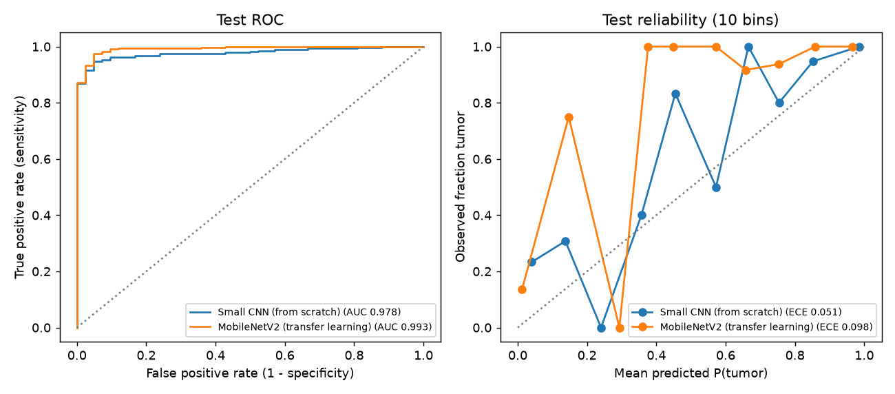
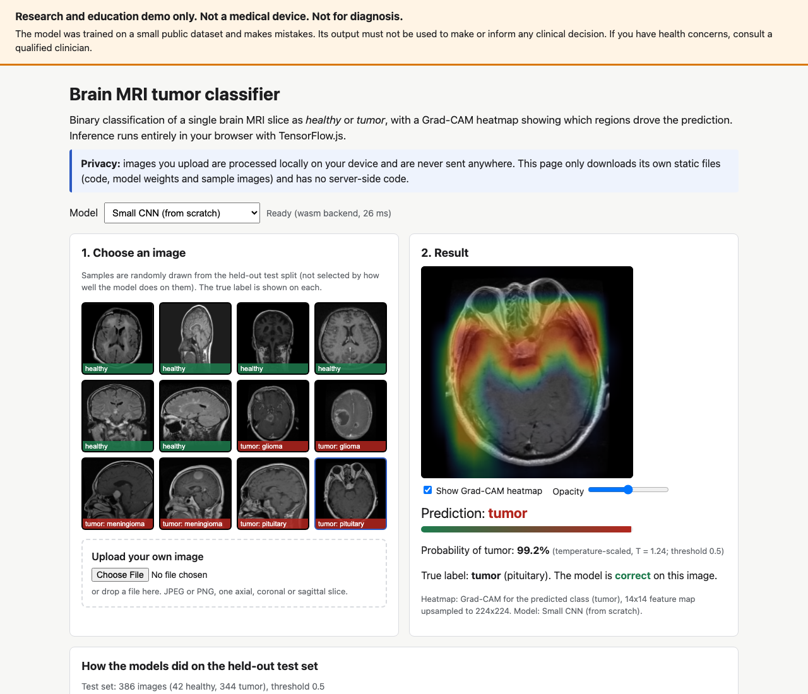

# Brain MRI Tumor Classification

Rebuilt from scratch in 2026. The original 2022 project code was not preserved.

Binary classification of single brain MRI slices as **healthy** or **tumor** with TensorFlow/Keras: a small CNN
trained from scratch and a MobileNetV2 transfer-learning model, evaluated on a deduplicated, group-split held-out
test set. Both models run in the browser with TensorFlow.js, with a Grad-CAM heatmap.

**Live demo:** https://brain-tumor-classification-five.vercel.app (static site, inference runs on your device)

> **Medical disclaimer.** This is a research and education project. It is not a medical device, it has not been
> clinically validated, and it must not be used for diagnosis or to inform any clinical decision.

## Dataset and license

- **Source:** [Brain Tumor Classification (MRI)](https://huggingface.co/datasets/sartajbhuvaji/Brain-Tumor-Classification)
  by Sartaj Bhuvaji, Ankita Kadam, Prajakta Bhumkar, Sameer Dedge and Swati Kanchan, published by the first author
  on the Hugging Face Hub. Public download, no login. Pinned to revision
  `011f2917d554afac5c962987e8134e835353726e`, with SHA-256 checks on both zip files (`src/btc/config.py`).
- **License:** MIT, as declared on the dataset card. (The authors' original GitHub repository has no license file.
  The provenance of individual scans is not documented upstream.) MIT allows redistribution, so the 12 demo
  sample images and 2 test fixtures are committed with the notice in `web/samples/LICENSE.txt`. The full raw
  dataset is not committed; `scripts/prepare_data.py` downloads it.
- **Content:** 3,264 JPEG slices in four folders: glioma 926, meningioma 937, no tumor 500, pituitary 901,
  pre-split into `Training/` and `Testing/`. Mixed sizes (72% are 512x512), mixed planes (axial, coronal,
  sagittal) and sequences. For the binary task, the three tumor types are merged into "tumor".

Other options checked: the figshare dataset of Cheng et al. (CC BY 4.0) has only tumor images, so it cannot
support healthy vs tumor on its own, and mixing its tumor scans with healthy scans from another source would let a
model separate sources instead of pathology. Many of the Hugging Face brain-tumor mirrors found in a search have
no license tag, so their redistribution terms are unclear. This dataset is published by its own author with an
explicit license.

## Deduplication and splitting

The dataset contains many duplicates, including across its own Training/Testing folders, so the provided split was
discarded.

1. Every image gets a 64-bit perceptual hash (`imagehash.phash` on grayscale). Pairwise Hamming distances were
   inspected visually: distance 0 to 2 is the same image (re-encoded, resized or re-cropped), 4 to 6 is mostly
   adjacent slices of the same series, 8 and above is mostly unrelated images.
2. **Duplicates (distance <= 2)** are merged with union-find and one copy (the highest resolution) is kept.
   Clusters whose members carry different labels are dropped entirely.
3. **Near-duplicates (distance <= 6)** are grouped, and whole groups are assigned to one split with
   `StratifiedGroupKFold` (stratified on the four classes, seed 42), so adjacent slices never straddle train and
   test.

| | Count |
|---|---|
| Images downloaded | 3,264 |
| Byte-identical duplicate files | 237 |
| Near-duplicate clusters (distance <= 2) | 369 |
| Duplicate copies removed | 554 |
| Label-conflicting clusters dropped | 3 (12 images) |
| **Images kept** | **2,698** (298 healthy, 2,400 tumor) |
| Original `Testing/` images with a duplicate in `Training/` | 259 of 394 (66%) |
| Groups at distance <= 6 (largest has 49 images) | 1,840 |
| Near-duplicate pairs crossing the new splits | 0 |

The healthy class shrank the most (500 to 298 images). The final splits:

| Split | Images | Healthy | Tumor (glioma / meningioma / pituitary) |
|---|---|---|---|
| Train | 1,926 | 213 | 1,713 (609 / 549 / 555) |
| Validation | 386 | 43 | 343 (122 / 110 / 111) |
| Test | 386 | 42 | 344 (122 / 110 / 112) |

Full statistics: `reports/dedup.json`. Split assignment for every image: `data/splits.csv`.

## Method

- **Input:** RGB, resized to 224x224 with bilinear interpolation (half-pixel centers, no antialiasing, the same op
  in TensorFlow and TF.js). Pixel values stay in [0, 255] and each model normalizes inside the graph
  (`x/255` for the CNN, `x/127.5 - 1` for MobileNetV2).
- **Augmentation (training only):** horizontal flip, rotation (up to 18 degrees), zoom (10%), translation (5%),
  brightness and contrast (10%).
- **Class imbalance:** 11% of training images are healthy. Balanced class weights (healthy 4.52, tumor 0.56) in
  the loss.
- **Small CNN (from scratch):** six 3x3 conv + batch norm + ReLU layers (32, 32, 64, 128, 128, 128 filters, a
  strided first layer and three max-pools), global average pooling, dropout 0.3, linear output. 0.40M parameters.
  Adam 1e-3, up to 40 epochs.
- **MobileNetV2 (transfer learning):** ImageNet weights, new head (global average pooling, dropout 0.3, linear
  output). Head only for 10 epochs at 1e-3, then the top 40 backbone layers fine-tuned for 20 epochs at 5e-5 with
  batch-norm statistics frozen. 2.26M parameters.
- Both use early stopping on validation ROC-AUC with best-weight restore, and learning-rate halving on plateau.
- **Calibration:** a temperature is fit on the validation split (NLL). The test set was used only for the final
  evaluation. Test metrics come with 95% bootstrap intervals (2,000 resamples, stratified by class).
- **Grad-CAM:** both heads are `Dense(GAP(A))`, so the Grad-CAM channel weights for the tumor logit are exactly
  `w_k / (h*w)`. The exported graph returns the map `sum_k w_k A_k / (h*w)`, and the class-specific heatmap is its
  positive part (tumor) or negative part (healthy). `tests/test_models.py` checks this closed form against
  autodiff Grad-CAM.

Training ran on the CPU of an Apple M5 laptop (TensorFlow 2.21, Keras 3.15): 18.0 minutes for the CNN (31 epochs)
and 15.4 minutes for MobileNetV2 (10 + 20 epochs). Each result below comes from one training run (seed 42), not
an average over seeds.

## Results (held-out test set, 386 images, threshold 0.5)

Positive class = tumor. Sensitivity = tumor recall, specificity = healthy recall. 95% bootstrap intervals in
parentheses.

| Model | Params | Accuracy | Sensitivity | Specificity | ROC-AUC | ECE raw / scaled | Brier raw / scaled |
|---|---|---|---|---|---|---|---|
| Small CNN (from scratch) | 0.40M | 94.6% (92.2 to 96.6) | 94.8% (92.4 to 97.1) | 92.9% (83.3 to 100) | 0.978 (0.964 to 0.989) | 0.042 / 0.051 | 0.042 / 0.042 |
| MobileNetV2 (transfer) | 2.26M | 94.6% (92.2 to 96.6) | 94.5% (91.9 to 96.8) | 95.2% (88.1 to 100) | 0.993 (0.984 to 0.999) | 0.062 / 0.098 | 0.040 / 0.043 |

Balanced accuracy: CNN 93.8%, MobileNetV2 94.9%.

Confusion matrices (rows = true, columns = predicted):

| | CNN: pred. healthy | CNN: pred. tumor | MobileNetV2: pred. healthy | MobileNetV2: pred. tumor |
|---|---|---|---|---|
| True healthy (42) | 39 | 3 | 40 | 2 |
| True tumor (344) | 18 | 326 | 19 | 325 |

Tumors detected, by type: CNN glioma 116/122, meningioma 98/110, pituitary 112/112; MobileNetV2 glioma 113/122,
meningioma 101/110, pituitary 111/112. Meningiomas are missed most often.



What this shows:

- MobileNetV2 ranks images better (ROC-AUC 0.993 vs 0.978). At the 0.5 threshold both models reach the same
  accuracy, and their intervals overlap heavily. With only 42 healthy test images, one extra error moves
  specificity by 2.4 points.
- Most errors are tumors called healthy with high confidence (the lowest-probability bin holds 23% tumors for the
  CNN and 14% for MobileNetV2). Class weighting pushes the decision boundary toward "healthy", which gives up
  sensitivity to gain specificity.
- **Calibration:** temperature scaling fit on the validation split did **not** improve test calibration (ECE rose
  from 0.042 to 0.051 for the CNN and from 0.062 to 0.098 for MobileNetV2). A single temperature cannot correct the
  prior shift that class weighting introduces, and the validation split has only 43 healthy images. The demo shows
  the temperature-scaled probability, labelled as such. Treat it as a rough score, not a calibrated risk.

### 4-class variant (MobileNetV2, same splits)

Accuracy 85.5%, macro F1 0.855, macro one-vs-rest ROC-AUC 0.961. Recall: glioma 82.8%, meningioma 72.7%, no tumor
92.9%, pituitary 98.2%. Confusion matrix (rows = true; glioma, meningioma, no tumor, pituitary):
`[[101, 15, 3, 3], [8, 80, 5, 17], [0, 1, 39, 2], [0, 2, 0, 110]]`. Not used in the demo.

Machine-readable results: `reports/cnn_binary.json`, `reports/mobilenet_binary.json`,
`reports/mobilenet_4class.json`, `reports/results.md`.

## Web demo

https://brain-tumor-classification-five.vercel.app



- Static files only (`web/`), served by Vercel. No server-side code runs, and no request leaves the site's origin.
  The TF.js runtime and its WASM backend are bundled in `web/vendor/`, and the Content-Security-Policy sets
  `connect-src 'self'`.
- Choose the model (small CNN or MobileNetV2). Then pick one of 12 sample images, drawn at random with a fixed seed
  from the test split (6 healthy, 2 of each tumor type) and shown with their true labels, or upload your own image.
  Uploads are decoded locally with an object URL and never sent anywhere. The page says so.
- The page shows the predicted class, the tumor probability, whether the prediction matches the true label (for
  samples), and a Grad-CAM heatmap overlay with opacity control.
- A disclaimer at the top of the page and in the footer: research/education demo, not a medical device, not for
  diagnosis.

**Browser vs Python parity.** `scripts/export_web.py` writes the Python outputs (logit, probability, Grad-CAM map)
for every sample and fixture to `web-tests/reference.json`.

- `npm run test:parity` runs the converted graph models in Node with the demo's own inference code
  (`web/inference.js`) on the CPU and WASM backends. The maximum absolute differences are 6e-5 (logit), 5e-6
  (probability) and 5e-6 (Grad-CAM). Tolerances are 1e-3, 1e-4 and 1e-3.
- `web-tests/e2e.py` drives headless Chromium against the live site. It clicks every sample with both models,
  uploads PNG and JPEG fixtures, checks the heatmap canvas is non-empty and the disclaimer is visible, and checks
  that no request goes to another origin. The maximum browser vs Python probability difference was 4.9e-6.

## Reproduce

```bash
uv sync
uv run python scripts/prepare_data.py            # download, dedup, split, cache (reports/dedup.json)
uv run python scripts/train.py --model cnn --task binary
uv run python scripts/train.py --model mobilenet --task binary
uv run python scripts/train.py --model mobilenet --task 4class
uv run python scripts/make_report.py             # reports/results.md and figures
uv run python scripts/export_web.py              # SavedModels, meta.json, samples, parity reference
./scripts/convert_tfjs.sh                        # TF.js graph models into web/models/
npm ci && npm run vendor && npm run test:parity
npm run serve                                    # http://localhost:4173
uv run --with playwright --python 3.12 python web-tests/e2e.py http://localhost:4173
```

`convert_tfjs.sh` installs `tensorflowjs` 4.22 into a separate virtualenv without its optional JAX and
TensorFlow Decision Forests dependencies, which do not resolve alongside TensorFlow 2.21.

## Tests and CI

- `uv run pytest` (fast, no dataset needed): perceptual-hash dedup and union-find, group split leakage, the
  committed split file against `reports/dedup.json`, metrics (confusion counts, ECE, temperature fitting,
  bootstrap), model shapes, closed-form vs autodiff Grad-CAM, and resize semantics.
- GitHub Actions (`.github/workflows/ci.yml`) runs the pytest suite and the Node TF.js parity test on every push
  and pull request.

## Limitations

- **Small, single-source data.** 2,698 images after deduplication, and only 298 healthy. The 42 healthy test
  images make specificity uncertain (the 95% interval spans 83% to 100% for the CNN).
- **No patient IDs.** The dataset has no patient or study identifiers, so perceptual-hash grouping is only a
  proxy. Different slices of one patient that do not look alike can still land in different splits, which may make
  the results optimistic.
- **Unknown provenance and label quality.** The images come from unspecified sources with mixed sequences and
  planes. Some "no tumor" images appear to be CT rather than MRI. Label errors in public brain-tumor datasets are
  common and were not audited here beyond dropping 3 label-conflicting duplicate clusters.
- **No external validation.** Nothing was tested on another dataset, scanner or hospital. Performance on real
  clinical images is unknown and probably much lower.
- **Slice-level only.** Real diagnosis uses full 3D studies, several sequences and clinical context.
- **Calibration is weak** (see Results), and the demo accepts any image, returning a meaningless prediction for
  non-MRI input.
- One training run per model. Seed-to-seed variation was not measured.

## Medical disclaimer

This software and the demo are for research and education only. They are not a medical device and have not been
cleared or approved by any regulator. They must not be used to diagnose, screen for, or rule out any disease, or
to guide treatment. Predictions can be wrong with high confidence. Anyone with health concerns should consult a
qualified clinician.

## License

Code: MIT (`LICENSE`). Dataset images: MIT, by the dataset authors (`web/samples/LICENSE.txt`).
